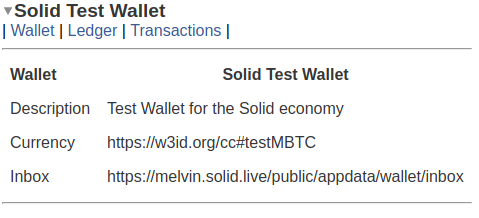
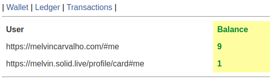
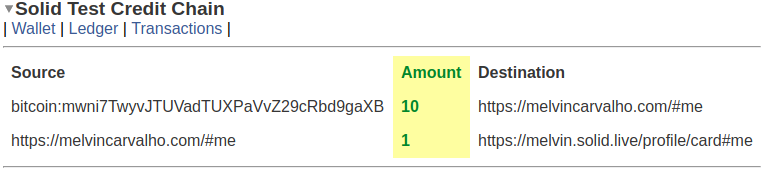

# General Concepts

## **Wallet**

A wallet is the parent of a ledger and a set of transactions, known as the CreditChain.  It can have meta data associated with it.  By convention every wallet will have exactly one currency that is used throughout the system.

## **Ledger**

A ledger is a set of users and balances.  Every user is denoted using a URI.  A ledger will also have a start state.  Also known as the Genesis Ledger.  By default all balances are null in the Genesis Ledger.  The Ledger is a derived data structure that is calculated from the initial state and the CreditChain.

## **CreditChain**

A credit chain is a chain of credit transactions that is used to derive the ledger from the initial state.  Credits are ordered and collected together so that the ledger can be verified and the Ledger computed.

### **Credit / Transaction**

A credit is a web credit that indicates a payment between two counter parties.  Another name for a credit is a transaction, the two terms will be used interchangeably.  By default the rule is that you cant send more funds that you have.  In other words no balance can drop below zero.

### Deposit

A deposit is a special kind of transaction that comes from an external system of the same currency.  For example you could deposit from a bitcoin testnet address to the address of a URI.  On verification of that transaction the URI can receive a higher balance.

### **Coinbase**

A coinbase is a special optional account in the Genesis Ledger which is allowed to start above zero.  The wallet creator will typically control the coinbase and set the rules of emission ie how those coins are distributed to the user base.  A coinbase will normally be backed by goods, services or other assets.

## Inbox

An inbox is a useful mechanism advertised by a wallet which instructs an agent where to send new credits.  Typically, those credits will be validated on receipt and if valid added immediately to the CreditChain, with the Ledger updated.

